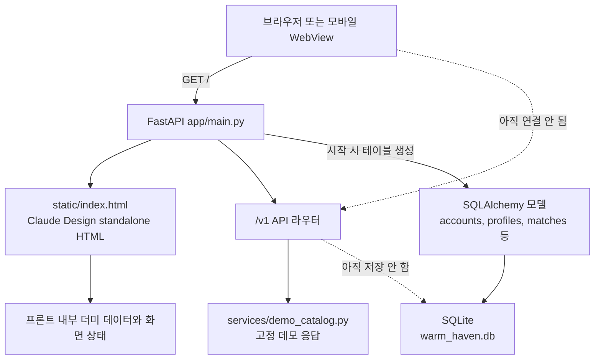
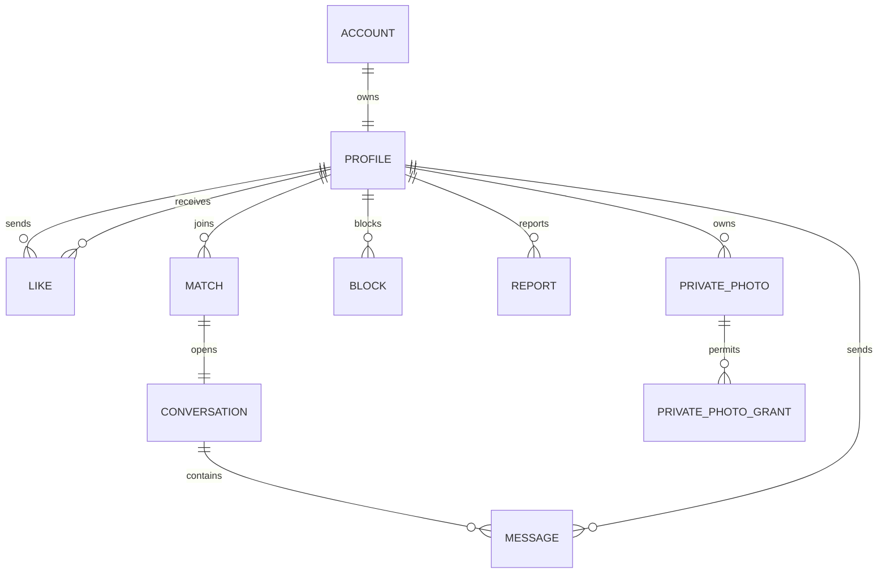
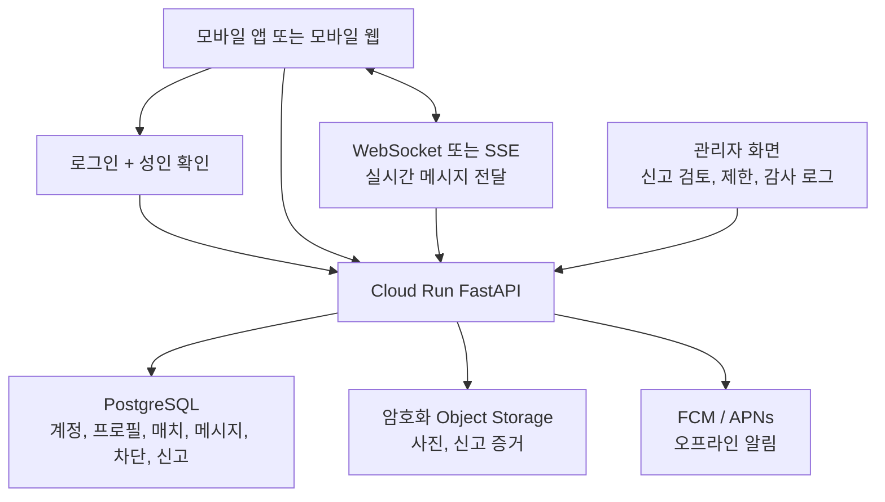

# Warm Haven 프론트엔드·백엔드 구조 비교

## 1. 결론

현재 Warm Haven은 **화면 프로토타입과 백엔드 초안이 같은 프로젝트 폴더에 있지만 아직 서로 연결되지 않은 상태**입니다.

- 프론트엔드: 사용자가 제공한 Claude Design standalone HTML입니다. 사람들, 매칭, 채팅, 설정, 신고, 차단, 공개 요청 사진 UI를 눌러 보며 흐름을 검토할 수 있습니다.
- 백엔드: AHTTY에서 검증한 `FastAPI + /v1 라우터 + /health + 정적 파일 제공` 구조를 참고해 만든 독립 API 초안입니다.
- 현재 연결 상태: 프론트엔드 HTML 안에는 `fetch`, `axios`, `/v1/`, `WebSocket` 호출이 없습니다. 화면은 프론트 내부 더미 데이터로 움직이고, 백엔드는 별도의 데모 응답을 반환합니다.
- 현재 DB 상태: SQLAlchemy 모델과 SQLite 테이블 구조는 있지만, API가 아직 DB에 읽고 쓰지는 않습니다.

쉽게 말하면 프론트엔드는 **모형 매장**, 백엔드는 **배관 도면과 시험용 수도꼭지**에 가깝습니다. 다음 단계에서 화면 이벤트를 API에 연결하고, 그 다음 인증과 실제 DB 저장을 붙이면 됩니다.

## 2. 현재 전체 구조



FastAPI가 프론트 HTML도 내려주고 `/v1` API도 제공하는 **단일 백엔드 앱**입니다. 초기 개발 속도를 높이기 위한 구조이며, 사용자 수가 늘어날 때 필요한 부분만 분리하면 됩니다.

## 3. 프론트엔드 구조

### 3.1 파일 구성

| 파일 | 역할 | 현재 상태 |
|---|---|---|
| `static/index.html` | Warm Haven 화면 전체 | 사용자 제공 원본을 그대로 보존 |
| `static/assets/legal-links.js` | 외부 링크에 `noopener noreferrer` 적용 | AHTTY 범용 자산을 복사했지만 현재 HTML에는 미삽입 |
| `static/assets/legal-footer.reference.css` | 약관·개인정보 링크 패널 스타일 참고본 | 참고용, 현재 HTML에는 미삽입 |

`static/index.html`은 일반적인 여러 파일 구조가 아니라 약 8.6MB 크기의 standalone 번들입니다. HTML 내부에 압축된 이미지와 폰트 자산이 포함되어 있고, 실행 시 번들을 풀어 실제 화면을 렌더링합니다.

이 방식은 화면 초안을 빠르게 검토하기에는 편하지만 운영형 프론트엔드로 유지하기에는 어렵습니다. 운영 전에는 화면 컴포넌트, 이미지, 폰트, API 호출 모듈을 분리해야 합니다.

### 3.2 화면별 역할

| 화면 | 사용자에게 보이는 기능 | 프론트엔드가 담당할 일 |
|---|---|---|
| 사람들 | 주변 또는 지역 기반 사용자 카드, 필터 | 필터 선택, 카드 렌더링, 프로필 상세 이동 |
| 매칭 | 좋아요, 패스, 매치 성사 모달 | 버튼 입력, 결과 애니메이션, 매치 성공 화면 |
| 채팅 목록 | 상대방, 최근 메시지, 안 읽은 수 | 목록 렌더링, 대화방 이동 |
| 대화방 | 메시지, 사진, 신고, 차단 | 입력창, 메시지 표시, 안전 메뉴 |
| 설정 | 개인정보, 차단 목록, 공개 요청 사진 | 공개 범위 설정, 승인 상대 관리 |
| 공개 요청 사진 | 승인된 상대에게만 보이는 사진 | 잠금 화면, 승인·철회 UI, 워터마크 표시 |

### 3.3 프론트엔드가 하면 안 되는 일

프론트엔드는 화면 표시와 사용자 입력만 담당해야 합니다. 다음 판단을 브라우저 안의 JavaScript만으로 처리하면 안 됩니다.

- 사용자가 성인 확인을 완료했는지 판단
- 누가 누구의 공개 요청 사진을 볼 수 있는지 최종 승인
- 차단한 사용자를 검색과 채팅에서 제외하는 최종 판정
- 신고 내용을 삭제하거나 처리 완료로 바꾸는 관리자 권한 판단
- 정확한 위치 좌표를 상대방에게 전달할지 판단

이 권한 판정은 조작하기 어려운 백엔드에서 처리해야 합니다.

## 4. 백엔드 구조

### 4.1 폴더별 책임

| 위치 | 책임 |
|---|---|
| `app/main.py` | FastAPI 생성, CORS 설정, `/health`, `/v1` 라우터 등록, 정적 HTML 제공 |
| `app/core/config.py` | `.env`와 환경 변수 읽기 |
| `app/core/db.py` | SQLite 또는 향후 PostgreSQL 연결 |
| `app/api/v1/` | 화면 기능별 HTTP API |
| `app/schemas/api.py` | API 요청과 응답 데이터 검증 |
| `app/models/entities.py` | DB 테이블 구조 |
| `app/services/demo_catalog.py` | 화면 연결 시험용 고정 응답 |

### 4.2 API 라우터 구조

```text
/health
/v1
  /public
    GET  /bootstrap
  /people
    GET  /
  /matches
    POST /likes
  /chats
    GET  /
    POST /{conversation_id}/messages
  /safety
    POST /blocks
    POST /reports
  /private-photos
    POST   /grants
    DELETE /grants/{grant_id}
```

### 4.3 현재 API의 의미

현재 API는 `DEMO_MODE=true`일 때만 사용하는 연결 시험용입니다.

- `GET /v1/people`은 고정된 프로필 목록을 반환합니다.
- `POST /v1/matches/likes`는 좋아요 또는 패스 요청을 받지만 저장하지 않습니다.
- `GET /v1/chats`는 고정된 채팅 목록을 반환합니다.
- 메시지, 차단, 신고, 사진 권한 API는 요청을 받으면 `demo_only` 상태의 영수증을 반환합니다.
- `DEMO_MODE=false`로 바꾸면 운영 저장소가 아직 없다는 의미로 대부분 `503`을 반환합니다.

따라서 지금의 백엔드는 가짜 운영 서버가 아니라 **프론트 연결 계약을 검증하기 위한 명시적인 데모 서버**입니다.

## 5. 프론트엔드와 백엔드 대응표

| 사용자 행동 | 프론트 화면 | 대응 API | 관련 DB 테이블 | 현재 연결 여부 | 운영형 구현 |
|---|---|---|---|---|---|
| 앱 실행 | 전체 앱 | `GET /v1/public/bootstrap` | 없음 | 미연결 | 기능 플래그와 안전 문구를 화면에 반영 |
| 지역·성향 필터 | 사람들 | `GET /v1/people?region=...&tag=...` | `profiles`, `blocks` | 미연결 | 차단 관계와 공개 범위를 적용해 검색 |
| 프로필 카드 열기 | 사람들 | 향후 `GET /v1/people/{profile_id}` | `profiles` | API 없음 | 공개 허용된 항목만 반환 |
| 좋아요 | 매칭 | `POST /v1/matches/likes` | `likes`, `matches`, `conversations` | 미연결 | 상호 좋아요이면 매치와 대화방 생성 |
| 패스 | 매칭 | `POST /v1/matches/likes` | `likes` | 미연결 | 추천 목록에서 제외하거나 재노출 정책 적용 |
| 채팅 목록 보기 | 채팅 | `GET /v1/chats` | `conversations`, `messages`, `blocks` | 미연결 | 로그인 사용자의 대화방만 반환 |
| 메시지 보내기 | 대화방 | `POST /v1/chats/{id}/messages` | `messages`, `blocks` | 미연결 | 매치·차단 상태 확인 후 저장 |
| 새 메시지 즉시 받기 | 대화방 | 향후 WebSocket 또는 SSE | `messages` | 없음 | 실시간 전달과 재접속 동기화 |
| 오프라인 알림 | OS 알림 | 향후 푸시 등록 API | 향후 `device_tokens` | 없음 | FCM/APNs로 알림 전송 |
| 사용자 차단 | 대화방 메뉴 | `POST /v1/safety/blocks` | `blocks` | 미연결 | 검색, 매칭, 채팅에서 양쪽 노출 중단 |
| 사용자 신고 | 대화방 메뉴 | `POST /v1/safety/reports` | `reports` | 미연결 | 관리자 검토 큐와 제한된 증거 보존 |
| 공개 요청 사진 승인 | 설정 | `POST /v1/private-photos/grants` | `private_photos`, `private_photo_grants` | 미연결 | 소유자 본인만 승인 가능 |
| 사진 승인 철회 | 설정 | `DELETE /v1/private-photos/grants/{id}` | `private_photo_grants` | 미연결 | 즉시 접근 차단, 접근 로그 기록 |
| 사진 업로드 | 설정 | 향후 업로드 URL 발급 API | `private_photos` | 없음 | 암호화 저장소와 만료 URL 사용 |
| 로그인 | 가입·로그인 | 향후 인증 API | `accounts` | 없음 | Firebase Auth 또는 별도 인증 제공자 연동 |
| 성인 확인 | 가입 | 향후 본인확인 결과 API | `accounts`, 향후 동의 이력 | 없음 | 인증 결과만 저장하고 원본 서류는 최소화 |

## 6. DB 모델 구조



| 테이블 | 저장 목적 | 중요한 필드 |
|---|---|---|
| `accounts` | 로그인 계정과 이용 상태 | 인증 제공자 식별자, 이메일, 성인 확인 여부, 계정 상태 |
| `profiles` | 공개 가능한 프로필 | 닉네임, 나이, 선택 지역, 체형, 정체성·성향 태그, 소개, 검색 노출 여부 |
| `likes` | 좋아요와 패스 | 보낸 사람, 받은 사람, 결정 |
| `matches` | 상호 좋아요 결과 | 두 프로필, 활성 상태 |
| `conversations` | 매치별 대화방 | 매치 ID, 대화방 상태 |
| `messages` | 채팅 메시지 | 대화방, 보낸 사람, 본문, 미디어 참조 |
| `blocks` | 차단 관계 | 차단한 사람, 차단된 사람 |
| `reports` | 신고 검토 큐 | 신고자, 대상자, 대화방, 신고 유형, 설명, 제한된 증거, 처리 상태 |
| `private_photos` | 공개 요청 사진 메타데이터 | 소유자, 저장소 객체 키, 상태 |
| `private_photo_grants` | 상대별 사진 열람 권한 | 사진, 소유자, 열람자, 만료, 철회 시각 |
| `consent_records` | 약관·민감정보·위치정보 동의 이력 | 계정, 동의 유형, 정책 버전, 동의 여부, 철회 시각 |
| `moderation_actions` | 관리자 신고 처리 감사 기록 | 신고, 처리 담당자, 조치 유형, 사유 |
| `private_photo_access_logs` | 공개 요청 사진 접근 감사 기록 | 사진, 열람자, 승인 ID, 접근 이벤트 |

현재 `profiles`의 태그와 `reports`의 증거 목록은 JSON 문자열로 잡혀 있습니다. 빠른 초안에는 적합하지만 운영 전 PostgreSQL로 옮길 때는 `JSONB` 또는 별도 관계 테이블 중 검색·감사 요구사항에 맞는 방식을 선택해야 합니다.

## 7. 운영형 백엔드 목표 구조



### 요청 처리 예시: 좋아요

```text
프론트에서 좋아요 클릭
  -> POST /v1/matches/likes
  -> 백엔드가 로그인 사용자를 확인
  -> 차단 관계와 대상 프로필 공개 여부 확인
  -> likes 저장
  -> 반대 방향 좋아요가 있는지 확인
  -> 있으면 matches와 conversations 생성
  -> 프론트에 match=true 반환
  -> 프론트가 매치 성사 모달 표시
```

### 요청 처리 예시: 메시지

```text
프론트에서 메시지 전송
  -> POST /v1/chats/{id}/messages
  -> 백엔드가 로그인 사용자와 대화방 참가 여부 확인
  -> 양방향 차단 여부 확인
  -> messages 저장
  -> 온라인 상대에게 실시간 이벤트 전송
  -> 오프라인 상대에게 푸시 알림 전송
```

### 요청 처리 예시: 공개 요청 사진

```text
사진 소유자가 특정 상대를 승인
  -> POST /v1/private-photos/grants
  -> 백엔드가 사진 소유자 본인인지 확인
  -> private_photo_grants 저장
  -> 열람자가 사진을 요청
  -> 백엔드가 승인, 만료, 철회 상태 확인
  -> 짧은 유효기간의 다운로드 URL 발급
  -> 워터마크와 접근 로그 적용
```

## 8. 현재 없는 운영 기능

다음 기능은 화면에 보이거나 모델에 자리가 있어도 아직 실제 구현이 아닙니다.

| 영역 | 현재 없는 것 | 필요한 이유 |
|---|---|---|
| 인증 | 로그인 토큰 검증, 세션, 계정별 권한 | 다른 사용자의 ID를 요청 본문에 넣는 조작 방지 |
| 성인 확인 | 본인확인 제공자 연동, 동의 이력 | 성인 전용 운영과 법률 검토 |
| DB 저장 | API 트랜잭션, 조회 쿼리 | 새로고침 후에도 데이터 유지 |
| 실시간 채팅 | WebSocket 또는 SSE | 메시지 즉시 전달 |
| 푸시 알림 | FCM/APNs, 기기 토큰 | 오프라인 사용자 알림 |
| 사진 저장 | 암호화 저장소, 업로드 검증, 만료 URL | 영구 공개 URL 방지 |
| 관리자 화면 | 신고 검토, 계정 제한, 감사 로그 | 성매매·스토킹·사진 악용 대응 |
| 위치 검색 | GPS 수집, 거리 구간 계산 | 위치정보 검토 후 별도 단계로 추가 |
| 배포 | Cloud Run, PostgreSQL, Secret Manager | 운영 환경 구성 |
| CSP | 허용 출처 기반 `Content-Security-Policy` | standalone HTML의 inline 스크립트와 외부 URL을 제거한 뒤 적용 |

현재 서버는 `nosniff`, `DENY`, `no-referrer` 보안 헤더를 기본 적용하고 GPS·카메라·마이크 브라우저 권한을 차단합니다. 향후 해당 기능을 구현할 때 필요한 경로만 좁게 허용합니다.

## 9. 구현 순서

1. standalone HTML을 유지한 채 사람들, 좋아요, 채팅 목록, 신고, 차단 버튼을 데모 API에 연결합니다.
2. 인증 제공자와 성인 확인 방식을 결정하고, 요청 본문의 사용자 ID를 신뢰하지 않도록 백엔드 권한 검증을 추가합니다.
3. 데모 응답을 SQLAlchemy 트랜잭션으로 교체하고 SQLite에서 기능을 검증합니다.
4. 관리자 신고 처리 화면과 감사 로그를 추가합니다.
5. 공개 요청 사진 업로드, 암호화 저장소, 만료 URL, 승인 철회를 구현합니다.
6. 실시간 메시징과 푸시 알림을 추가합니다.
7. 운영 배포 전에 PostgreSQL과 Cloud Run으로 전환합니다.
8. GPS 주변 탐색은 위치정보법 검토와 운영 준비가 끝난 뒤 별도 단계로 추가합니다.

## 10. 관련 문서

- `README.md`: 로컬 실행 방법
- `WORKSPACE.md`: 작업 기록과 다음 우선순위
- `docs/API_DRAFT.md`: 현재 데모 API 목록
- `docs/ARCHITECTURE.md`: 초기 구조 요약
- `docs/ASSET_INVENTORY.md`: HTML과 AHTTY 참고 자산 점검
- `docs/SAFETY_AND_LEGAL.md`: 안전·법률 체크리스트
